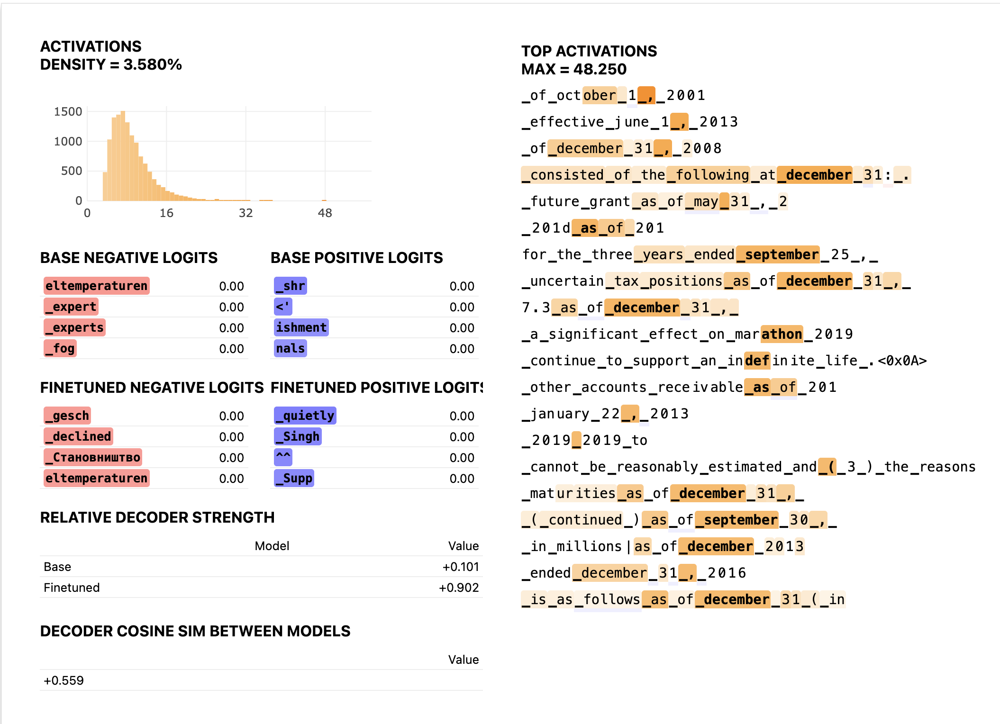

# Crosscoder Vis

This is a fork of ckkissane's [sae_vis](https://github.com/ckkissane/sae_vis) that can generate latent dashboards for model-diffing [crosscoders](https://transformer-circuits.pub/2024/crosscoders/index.html). 

See the "generating latent dashboards" section of this [colab demo](https://colab.research.google.com/drive/1vfMoIbCthGXpe3PYKciHM4TnDwt7miQ5) to use it.

Example dashboard:

The dashboards also have activating examples at other ranges (i.e. not just max activating), just like in sae_vis, not shown in the image.
## Motivation

Current SAE visualization tools are based on transformer_lens and do not support `mistral-7b-instruct-v0.3` inference. Therefore, I changed the LLM interpretability library to nnsight, which supports a wide range of LLMs and their variants. I also added the [BatchTopk crosscoder](https://arxiv.org/pdf/2504.02922) visualization. Howerver, the tool only supports Mistral LLM and the activations are collected only at the MLP output. 